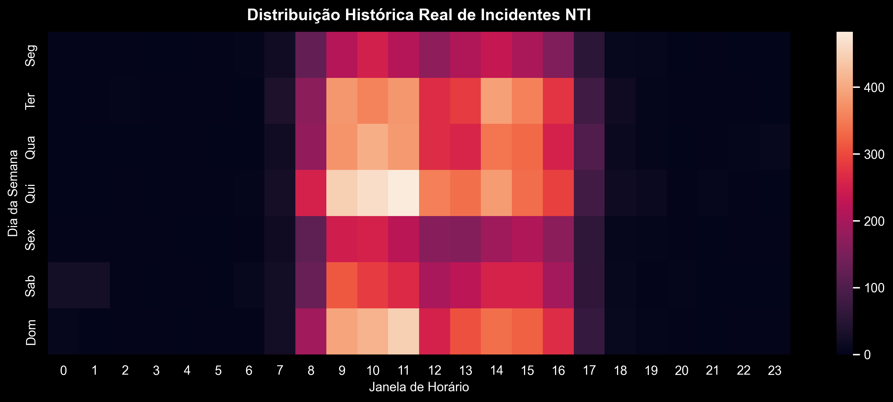
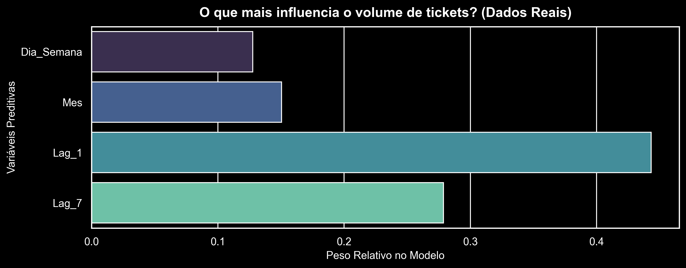
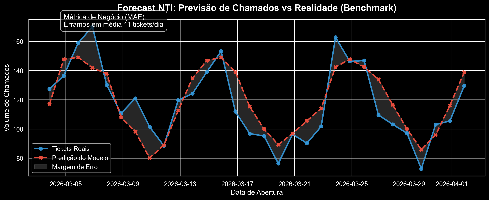

# Ticket Predict

## Capa

## Problema de Negócio
No mundo corporativo da Tecnologia da Informação, o Suporte de TI / NTI (Núcleo de Tecnologia da Informação) frequentemente atua como um refém das demandas logísticas. O modelo reativo gera picos de chamados imprevisíveis que causam:
- Estresse e *Burnout* por picos de sobrecarga na equipe;
- Quebra aguda nos SLAs (Acordos de Nível de Serviço);
- Despesas ocultas drásticas com banco de horas e *overtime* da equipe técnica.

A equipe técnica e gerencial, em muitos dias, passa todo o expediente esgotando energia atuando como "bombeiros" logísticos para apagar incêndios inesperados nas métricas operacionais, em vez de alocar tempo para melhorias no sistema ou qualidade.

## Objetivo do Projeto
Transformar o suporte do NTI de uma central reativa padrão da indústria para um modelo operacional **Proativo**, focando em *Capacity Planning* preditivo de ponta-a-ponta (Data Prep até Deploy).
O objetivo macro e imediato do modelo preditivo MLOps é calcular de forma estatística antecipada:
1. **O Volume Diário de Chamados Esperados.**
2. **A Carga de Trabalho Total Estimada (Workload em Horas de NTI a ser dedilhado no dia).**

## Estratégia da Solução
A fundação da arquitetura lógica foi desenhada seguindo regras de ouro de Engenharia de Software (SOLID e DRY) unidas ao rigor das proteções sistêmicas para implantação de Aprendizado de Máquina (Prevendo *Data Leakage*):
A estrutura analítica consumiu dados tabulares contínuos ITSM brutos do ServiceNow:
*   **Pipeline em Medallion Architecture:** O fluxo processa em pipeline as extrações brutas (Bronze) garantindo versionamento cru. Logo após as features temporais são refinadas transformando o formato linear em dimensões *Cíclicas Trigonométricas*. Ao mesmo passo impomos a aglomeração orgânica de cauda longa substituindo os metadados muito dispersos na camada formatada (Silver). A camada final (Gold) derruba todos as linhas de dados independentes e transforma o arquivo em um "Colapso/Resample Físico Contínuo e Multi-Target", gerando a verdadeira batida do tempo de série preditiva.
*   **Abordagem Preditiva Focada em Negócios:** O Forecasting de Volume usou separação total entre os interesses de pesquisa (minimizar `RMSE` para blindagem paramétrica contra desastres fora e picos atípicos) e Otimização para Negócios (`MAE` sendo uma régua mais comunicativa perante reuniões do Corpo Diretivo HR e C-Level).

## Tecnologias Utilizadas
*   **Python 3.12+**
*   **Manipulação de Dados (ETL Vetorizado e Reshaping):** Pandas, NumPy
*   **Gestão Dinâmica de Governança Estática:** PyYAML
*   **Machine Learning / Cross Validation e Pipelines MLOps:** Scikit-Learn (`TimeSeriesSplit`, `Pipeline`)
*   **Time Series Analytics e Física do Tempo:** Statsmodels (`seasonal_decompose`, `ACF/PACF`)
*   **Análises Visuais / Dashboarding Preditivo:** Matplotlib, Seaborn
*   **Isolamento, Ambiente e Containers:** Docker, Python `venv` 

## Etapas do Projeto
1. **Ingestão:** Leitura e tipagem O(N) de grandes volumes brutos preservando logs passados impuros de memória.
2. **Data Cleansing Vetorial:** Criação do ambiente limpo *Rare Label Dynamic Encoding*, com suporte de Configuração Imputativa Baseada na Matriz Padrão de Prioridade (Impact vs Urgency ITIL). 
3. **Deep EDA (Time Physics e Time Series Exploration):** A consolidação estatística matemática para mapear Tendências Ocultas sob O Gaping Sazonal dos Relatórios.

  

4. **Estabelecimento de Benchmark (Régua de Falha Mínima):** Implementação e construção agressiva de Modelos *Naive Lineares de Smoothness* (Média Móvel de Múltiplos percursos), blindando contra "Holiday Outages/Falhas Null Diárias" através do acréscimo dinâmico geométrico do preenchimento histórico limitador `.shift(1)`.

## Principais Insights

*   **O Risco Exponencial Subjacente do Help Desk:** A volatilidade agressiva atestada durante as plotagens e CV cruzado no Baseline provam que "modelos lineares e estatísticas rasas" sempre colapsam a precisão do forecast por sofrerem de retardo de percepção retroativo no NTI. O desvio padrão gigantesco (> 130 vs avg 60) clama pela utilização de lógicas algorítimcas de múltiplas profundidades. 
*   **Transição de Responsabilidades Preditivas:** Entender que ferramentas analíticas falham nas interrupções exige uma rotação iminente do nosso sistema arquiteturally pronto para acolher modelos Cíclicos baseado em Árvores Inteligentes Parametrizáveis - Capazes de domar falhas sazonais prevendo comportamentos sistêmicos subjacentes através de Lags cruzados na estrutura dimensional, no qual o `XGBoost` dominará o ambiente sem prejudicar os limites preestabelecidos do sistema atual.

## Resultados

A fundação logística computacional pronta isolou todas os gargalos passíveis do ecossistema original, criando a Régua Base (Benchmark RMSE/MAE Base). Com o tráfego preditivo liberado contra furos causados via Data Leakage, possuímos um ecossistema com "Check-engine lights" estrito capaz de mensurar financeiramente e operar predições com segurança sistêmica no projeto, e aprovar orçamentos futuros robustos mediante saving de horas gerenciais.
