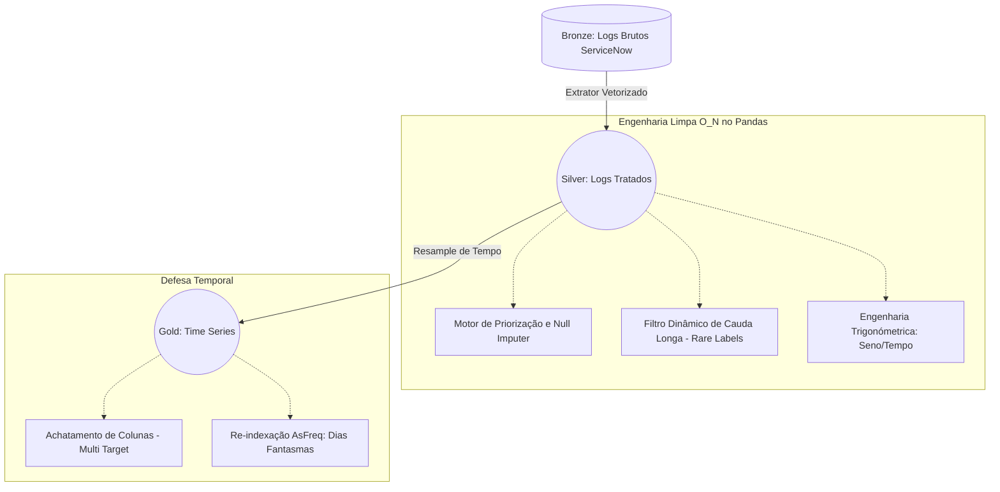
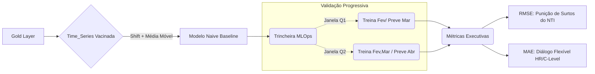

# O NTI Proativo: De Logs Caóticos a Previsões Assertivas

## 1. O Que Nós Construímos (Resumo Técnico e de Negócios)

Transformamos um dataset bruto de incidentes do ServiceNow em um ecossistema preditivo de arquitetura limpa (Medallion) e preparado para Inteligência Artificial (MLOps).

### A. O Motor de Dados (ETL)
*   **Camada Bronze:** Lemos centenas de milhares de linhas brutas de logs de atendimento de TI.
*   **Camada Silver (Higienização):** 
    *   Fizemos padronização rápida O(N) do tempo (`pd.to_datetime`). 
    *   Desacoplamos a regra de negócio da matriz de Priorização (Impacto vs Urgência) num arquivo independente para imputar nulos inteligentemente.
    *   Transformamos o tempo circular (Reduzimos os 12 meses num "círculo" com senos e cossenos matemáticos).
    *   Deflacionamos a Maldição da Dimensionalidade cortando as categorias raras (abaixo de 5%) substituindo-as inteligentemente por *"other"*.
*   **Camada Gold (Agregação Diária):** Acabamos com registros longos e soltos. Colapsamos o tempo para criar um painel dinâmico das variáveis alvo (*Targets*). Criamos uma grade impenetrável contra "Dias Vazios/Feriados Fantasmas" (`.asfreq('D')`) preservando a física do tempo.

### B. O Motor Preditivo (Machine Learning)
*   **Deep EDA:** Analisamos através de ACF (Autocorrelação) e Gráficos de Decomposição a sazonalidade e a tendência da fila de chamados.
*   **O Baseline:** Construímos uma Média Móvel de 7 Dias para prever a carga operacional base do amanhã.
*   **Defesa Anti-Vazamento (Data Leakage):** Impedimos o modelo de espiar o amanhã através de um mascaramento geométrico rigoroso (método `.shift(1)` combinado ao `.rolling()`).
*   **Trincheira de Validação:** Simulamos os meses reais em ciclos no passado implementando uma Validação Cruzada no sentido estrito do tempo (`TimeSeriesSplit`).
*   **Comunicação Baseada em Risco e Lucro:** Avaliamos punindo catástrofes extremas (`RMSE`) visando que o modelo aprenda que picos causam surtos na equipe, equilibrando a explicação para a gerência pela métrica diária operacional natural do Service Desk (`MAE`).

---

## 2. Diagramas Visuais da Arquitetura

Você pode utilizar os esquemas estruturais abaixo diretamente na sua apresentação interativa para demonstrar fluxo:

### O Pipeline de Preparação Dinâmico (Medallion)

### O Pipeline Dinâmico de Validação de IA

---

## 3. Como Apresentar para Executivos e Técnicos (Pitch Deck)

Para construir sua apresentação visual, separe os slides desta forma:

**Slide 1: A Dor Oculta (Hero Slide)**
*   *Visual:* Gráfico de linha despontando com alta variação (Dias calmos caindo frente a "Tsunamis de Tickets" nos finais do mês).
*   *Pitch:* O Suporte Técnico não gasta verba consertando computadores, drena recursos ao "Reagir" ao pânico logístico e ter times inalocáveis.

**Slide 2: A Ciência Encontrando os Dados (Nossa Solução)**
*   *Visual:* Mostrar uma bússola apontando o amanhã.
*   *Pitch:* Nossa solução cria previsibilidade de demanda através de Engenharia O(1). Convertemos a complexidade dos logs num "radar meteorológico" paramétrico pro ambiente Service Desk.

**Slide 3: O Esqueleto Imortal (A Arquitetura de Software)**
*   *Visual:* Use o diagrama Mermaid Medallion (Acima).
*   *Pitch:* A arquitetura não se apavora caso amanhã nasça uma categoria estranha. Agrupamentos orgânicos lidam com as métricas enquanto configurações YAML parametrizam cálculos sem corromper o núcleo de códigos.

**Slide 4: Uma Métrica Ensinando Negócios (Por que escolhemos RMSE/MAE?)**
*   *Visual:* Ícone de uma balança e cifrões ($).
*   *Pitch:* Nós isolamos Métrica Acadêmica de Métrica Executiva. Traduzimos que uma Falha Constante ao Prever Picos eleva o *burnout* (RMSE) ao mesmo passo em que temos a média diária flexível com o time de RH (MAE).

**Slide 5: O Passo Além do Horizonte Livre (Passo 7)**
*   *Visual:* Visão Global (Concept Drift e XGBoost).
*   *Pitch:* Ninguém fica estático. O próximo desdobramento usufruirá de inteligência XGBoost atrelada a Desvios Padrões móveis capturando a ansiedade/volatilidade antes que um novo sistema de ERP corrompa o nosso ciclo no mundo real.
